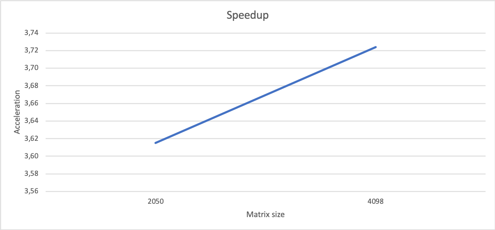

# Gauss Seidel using OpenMP

This small project contains the implementation of the <a href="https://en.wikipedia.org/wiki/Gauss–Seidel_method">Gauss Seidel linear equations solver</a>, using <a href="https://en.wikipedia.org/wiki/OpenMP">OpenMP</a> for parallelizing the load over different CPU threads. The Gauss Seidel method for solving linear equations is an iterative method, in which the values for the given variables keep changing until a certain threshold of variance is reached.

The goal of this projet was to provide a faster resolution time than the sequential version of the code, which is also provided in the repository.

<br>

## How does it work?

### General considerations:

In order to parallelize the calculations, certain data dependency constraints need to be omitted. This constraint relaxation will only mean that the *solver* function will take longer iterations to reach the predefined *threshold*. However, this is totally fine, as **the speedup that is achieved by splitting the calculation, is way higher than the cost of a couple more iterations**.

### Parallelization steps:

<b>1. Decomposition:</b> each thread will execute the *solver* function over a set of rows. Given data dependency with the cells above and below the target one, the number of matrix rows given to each thread is **N+2**, being **N**, the number of rows that node needs to compute.

<b>2. Assignation:</b> in order to assign rows to threads, we have applied the following logic:

```C
int max_rows_per_th = (int)(ceil((n-2) / num_nodes) + 2;
int max_cells_per_th = max_rows_per_th * (n-2)
```

<b>3. Orchestation:</b> there is no orchestation needed as OpenMP is able to evenly split the cells among the available threads, leading to each thread having some unique rows assigned.

<b>4. Mapping:</b> each thread is mapped to an avaiable CPU core.

<br>

## What is in the repository?

The repository contains:

- <b>Sequential code version</b> (*gc_seq.c*).
- <b>OpenMP code version</b> (*gs_openmp.c*).
- <b>Bash script:</b> for executing with multiple configurations (*exec_script.sh*).
- <b>Makefile:</b> used to compile and clean the project.

<br>

## Usage

First of all, **the *OpenMP* library needs to be installed**. Later on, the code needs to be compiled by using the following shell command:

```shell
$ make
```

Once the code is compiled, it received only 1 argument:

- <b>Matrix size:</b> usually a power of 2 (64, 128, 256, 1024...).

The execution command will be as follows:

```shell
$ ./gs_openmp <matrix_size>
```

Example:

```shell
$ ./gs_openmp 1024
```

<br>

## Results

As the whole goal of this project was to speed-up the resolution of the linear equation system, it is important to state the obtained acceleration. The speed-up values have been computed using the <a href="https://en.wikipedia.org/wiki/Amdahl%27s_lawAmdhals">Amdahl's law</a>:

<p align="center">
	
</p>

<br>

## Authors

This project was developped by:

[Sinclert Pérez](https://github.com/Sinclert)

[Silvia Barbero](https://github.com/fyrier)

[Pablo León](https://github.com/PLeon6822)
